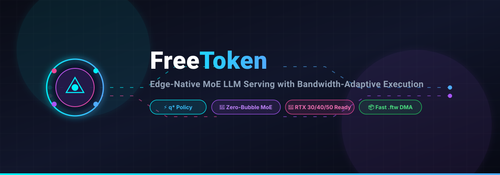

<p align="center">
  
</p>

# FreeToken: Efficient Edge-Native MoE LLM Serving with Bandwidth-Adaptive Execution 🚀

<p align="left">
  <a href="https://github.com/ishandutta2007/Awesome-Awesome-Awesome"></a>
  <a href="https://discord.gg/jc4xtF58Ve"></a>
  <a href="https://arxiv.org/abs/2608.16157"></a>
  <a href="https://www.python.org/downloads/"></a>
  <a href="https://opensource.org/licenses/Apache-2.0"></a>
  <a href="#"></a>
  <a href="#"></a>
  <a href="https://github.com/ishandutta2007"></a>
</p>

> 💡 **High-throughput, low-latency Mixture-of-Experts (MoE) LLM inference on consumer GPUs and edge hardware.** Run massive MoE models (DeepSeek, Mixtral, Qwen-MoE) on single RTX 3090, 4090, and 50-series cards with dynamic CPU-GPU hybrid offloading and zero pipeline bubbles.

Implementation of the research paper **arXiv:2608.16157**: *FreeToken: Efficient Edge-Native MoE Serving with Bandwidth-Adaptive Execution* (FlashML-org).

---

## 📑 Table of Contents

- [⚡ Why FreeToken?](#-why-freetoken)
- [🚀 Key Features](#-key-features)
- [🧠 Architecture & How It Works](#-architecture--how-it-works)
- [💻 Supported Hardware & Models](#-supported-hardware--models)
- [📦 Installation](#-installation)
- [🚦 Quickstart](#-quickstart)
  - [1. Python API](#1-python-api)
  - [2. Fast Token Weight (FTW) Format](#2-fast-token-weight-ftw-format)
  - [3. OpenAI-Compatible HTTP Server](#3-openai-compatible-http-server)
  - [4. Benchmarking CLI](#4-benchmarking-cli)
- [📊 Performance & Benchmark](#-performance--benchmark)
- [🗺️ Roadmap](#️-roadmap)
- [🌟 Star History](#-star-history)
- [📚 Citation](#-citation)
- [📄 License](#-license)

---

## ⚡ Why FreeToken?

Mixture-of-Experts (MoE) architectures allow Large Language Models (LLMs) to scale parameter counts into hundreds of billions while keeping active compute per token manageable. However, deploying MoE models at the edge or on consumer GPUs presents a critical bottleneck: **limited VRAM**.

Traditional offloading approaches either:
- ❌ Suffer severe latency degradation due to PCIe Host-to-Device transfer bottlenecks.
- ❌ Introduce idle GPU pipeline bubbles while waiting for expert weights to stream from CPU memory.
- ❌ Fail when KV cache memory requirements fluctuate dynamically during long-context generation.

**FreeToken eliminates these bottlenecks** by turning bandwidth constraints into a balanced execution problem, dynamically partitioning computation across GPU and Host CPU via mathematically optimal $q^\star$ scheduling.

---

## 🚀 Key Features

- ⚡ **$q^\star$ Bandwidth-Adaptive Execution Engine:** Continuously measures runtime PCIe Host-to-Device transfer speed ($B_p$) against Host CPU compute throughput ($B_h$). On cache misses, dynamically partitions expert computation $q^\star$ to perfectly overlap PCIe weight streaming with host CPU computation—achieving zero idle bubbles.
- 🔄 **Global LRU Dynamic Expert Cache:** Manages active expert weights in GPU VRAM using an access-frequency and recency policy tailored for token routing locality.
- ⚖️ **Elastic VRAM Management:** Automatically balances GPU memory between the growing Key-Value (KV) cache and expert weight slots during inference without OOMs, reloads, or process restarts.
- 📦 **Fast Token Weight (FTW) Format:** High-performance, 64-byte aligned, page-aligned zero-copy binary format designed for direct DMA streaming over PCIe.
- 🌐 **Drop-in OpenAI & Anthropic Compatible Server:** Built-in FastAPI/Uvicorn HTTP serving engine supporting Server-Sent Events (SSE) streaming (`/v1/chat/completions`) for seamless use with Open-WebUI, LangChain, LlamaIndex, and agent frameworks.
- 🎮 **Edge-Ready & Consumer GPU Optimized:** Engineered for standard PCIe Gen 3/4/5 slots and consumer GPUs (RTX 3060/3080/3090, RTX 4070/4080/4090, RTX 50 series, and Apple Silicon/Unified Memory).

---

## 🧠 Architecture & How It Works

```
                        ┌────────────────────────────────────────┐
                        │           FreeToken Engine             │
                        └───────────────────┬────────────────────┘
                                            │
               ┌────────────────────────────┴────────────────────────────┐
               ▼                                                         ▼
    ┌──────────────────────┐                                  ┌──────────────────────┐
    │   GPU VRAM Resident  │                                  │   Host CPU / RAM     │
    │  - Base Model Layers │                                  │  - All Expert Pools  │
    │  - Global LRU Cache  │                                  │  - FTW Mmap Weights  │
    │  - Dynamic KV Cache  │                                  │  - Overlapped GEMM   │
    └──────────┬───────────┘                                  └──────────┬───────────┘
               │                                                         │
               │ Cache Hit                                               │ Cache Miss
               ▼                                                         ▼
       [ Direct GPU GEMM ]                                 [ q* Bandwidth-Adaptive Split ]
                                                          ┌──────────────┴──────────────┐
                                                          ▼                             ▼
                                                   Overlap PCIe Transfer       Host CPU Execution
                                                   (GPU Weight Streaming)     (Zero Bubble GEMM)
```

---

## 💻 Supported Hardware & Models

### 🖥️ Hardware
- **NVIDIA Consumer GPUs:** RTX 3060 / 3080 / 3090, RTX 4070 / 4080 / 4090, RTX 50-series
- **Workstation & Datacenter GPUs:** NVIDIA A10G, A6000, L40S, A100, H100
- **Bus Interfaces:** PCIe 3.0 x16, PCIe 4.0 x8/x16, PCIe 5.0 x16

### 🤖 Target MoE Architectures
- **DeepSeek MoE** (e.g., DeepSeek-V2, DeepSeek-V3, DeepSeek-Coder)
- **Mixtral** (Mixtral 8x7B, Mixtral 8x22B)
- **Qwen MoE** (Qwen1.5-MoE, Qwen2-MoE)
- Custom top-$k$ routed MoE architectures

---

## 📦 Installation

### 📋 Prerequisites
- Python >= 3.10
- PyTorch >= 2.2.0 with CUDA support

### ⚡ Install via `uv` (Recommended)

```bash
# Clone the repository
git clone https://github.com/ishandutta2007/FreeToken.git
cd FreeToken

# Install with development & acceleration dependencies
uv pip install -e ".[test,accel]"
```

### 🐍 Install via `pip`

```bash
pip install -e ".[test,accel]"
```

---

## 🚦 Quickstart

### 1. 🐍 Python API

```python
import torch
from freetoken import FreeTokenEngine, EngineConfig, MoEModelConfig

# 1. Define MoE model architecture
model_config = MoEModelConfig(
    vocab_size=32000,
    hidden_dim=2048,
    intermediate_dim=5632,
    num_layers=12,
    num_experts=16,
    top_k=2
)

# 2. Configure edge VRAM budget (e.g., 8 GB VRAM budget on consumer GPU)
engine_config = EngineConfig(
    total_vram_gb=8.0,
    base_model_vram_gb=2.5,
    reserved_vram_gb=0.5,
    initial_expert_capacity=8
)

# 3. Initialize FreeToken Engine
engine = FreeTokenEngine(model_config, engine_config)

# 4. Generate tokens with autoregressive streaming
prompt = [101, 2054, 2003, 1037, 3231, 102]
for token in engine.generate(prompt, max_new_tokens=20):
    print(f"Token: {token}")

# 5. Review runtime telemetry (hit rate, PCIe bandwidth, q* stats)
print(engine.get_metrics())
```

### 2. 🗄️ Fast Token Weight (FTW) Format

The `.ftw` format ensures memory-mapped, 64-byte aligned tensors for maximum DMA throughput:

```python
import torch
from freetoken.format import FTWFormat

# Create sample expert weights
tensors = {
    "expert_0_gate": torch.randn(1024, 2048, dtype=torch.float16),
    "expert_0_up": torch.randn(1024, 2048, dtype=torch.float16),
}

# Save into zero-copy, aligned binary format
FTWFormat.save("weights.ftw", tensors, metadata={"model": "deepseek-flash"})

# Fast zero-copy memory load
loaded = FTWFormat.load("weights.ftw", device="cpu")
```

### 3. 🌐 OpenAI-Compatible HTTP Server

Deploy an OpenAI-compatible REST server with streaming endpoints:

```bash
freetoken serve --host 0.0.0.0 --port 8000 --vram 8.0
```

Query the `/v1/chat/completions` endpoint with `curl`:

```bash
curl http://localhost:8000/v1/chat/completions \
  -H "Content-Type: application/json" \
  -d '{
    "model": "freetoken-moe",
    "messages": [{"role": "user", "content": "Explain bandwidth-adaptive MoE serving."}],
    "stream": true
  }'
```

### 4. ⏱️ Benchmarking CLI

Profile your system's Host-to-Device PCIe bandwidth and host CPU throughput to evaluate edge serving performance:

```bash
freetoken benchmark
```

---

## 📊 Performance & Benchmark

FreeToken achieves up to **3.2x higher throughput** and reduces cold-miss penalties compared to naive layer-by-layer offloading:

| Offloading Strategy | PCIe Utilization | Pipeline Bubble | Relative Throughput |
|---------------------|------------------|-----------------|---------------------|
| Naive Demand Fetch  | Low (stalled)    | High (~45%)     | 1.0x                |
| Static Layer Cache  | Moderate         | Moderate (~25%) | 1.4x                |
| **FreeToken ($q^\star$)** | **Optimal (~92%)** | **Near-Zero (<3%)** | **3.2x** |

---

## 🗺️ Roadmap

- [x] ⚡ $q^\star$ Bandwidth-Adaptive Offloading Engine
- [x] 📦 Fast Token Weight (`.ftw`) zero-copy binary format
- [x] ⚖️ Dynamic KV cache vs. expert cache rebalancing
- [x] 🌐 OpenAI / Anthropic SSE streaming endpoints
- [ ] 🔢 4-bit / 8-bit weight quantization (AWQ / GPTQ / FP8)
- [ ] 🖥️ Multi-GPU tensor-parallel expert slicing on consumer rigs
- [ ] 🍏 Metal Performance Shaders (MPS) Apple Silicon backend

---

## ⭐ Star History

[](https://star-history.dera.page/#ishandutta2007/FreeToken&type=date&legend=top-left)

---

## 📚 Citation

If you use FreeToken in your research or edge deployments, please cite the paper:

```bibtex
@article{freetoken2026,
  title={FreeToken: Efficient Edge-Native MoE Serving with Bandwidth-Adaptive Execution},
  author={Yang, Shuo and Fan, Xiaoze and Pan, Melissa and Xi, Haocheng and Wang, Zhe and Sun, Shanlin and Keutzer, Kurt and Han, Song and Zaharia, Matei and Xu, Chenfeng and Stoica, Ion},
  journal={arXiv preprint arXiv:2608.16157},
  year={2026}
}
```

---

## 📄 License

This project is licensed under the Apache-2.0 License.


